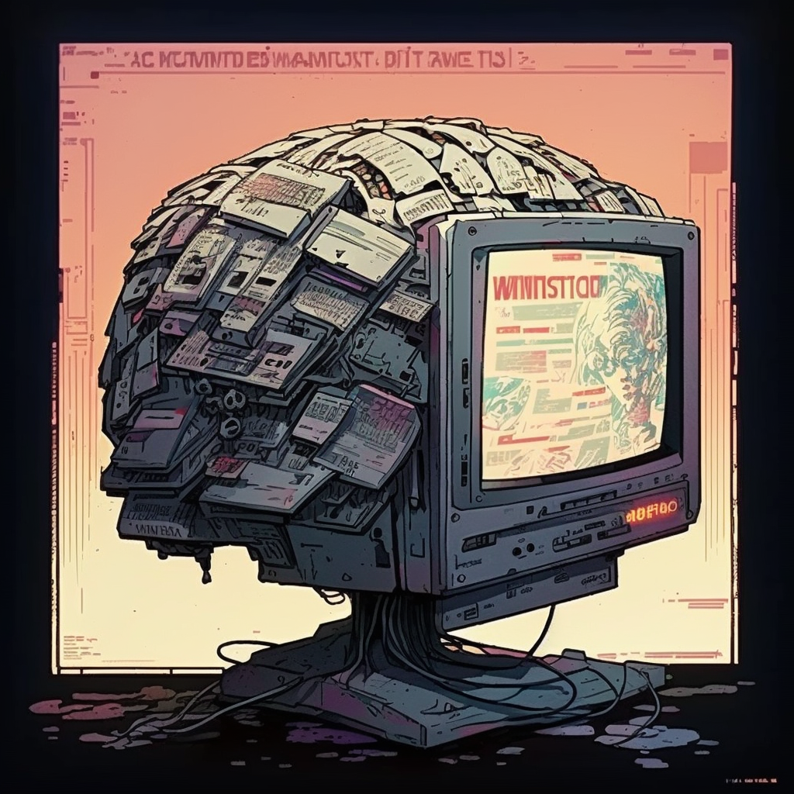

# TubeGPT

This repo is an assistant for YouTube creation. It can generates thumbnails, titles, descriptions.




## Setup

Dependencies and keys required:

- OpenAI 🔑
- Notion 🔑
- Replicate 🔑
- GoogleAPI 🔑
- Midjourney + Discord 🔑
- Fonts from https://fonts.google.com/
- Arxiv API

Insall local python dependencies:

```
pip install -r requirements.txt
```

## YouTube

This repo was built live on YouTube, you can find the playlist here:

```
[](https://youtube.com/playlist?list=PLwq2F0NejwX5Hc80-ExN9JfnbMAHR7HAn)
```

## Citation

```
@misc{hupo2023tubegpt,
  title={TubeGPT: YouTube Assistant},
  author={Hugo Ponte},
  year={2023},
  url={https://github.com/hu-po/TubeGPT}
}
```
